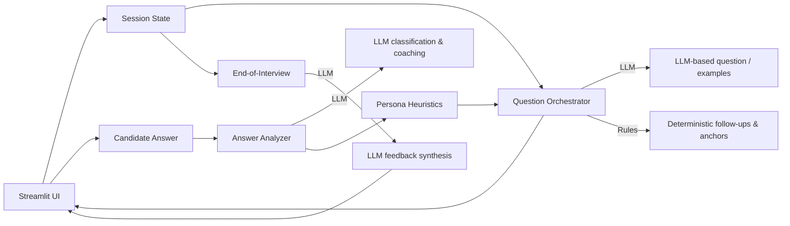

# Interview Practice Partner

**An adaptive AI interviewer (Streamlit + Gemini) that runs role-aware mock interviews, asks meaningful follow-ups, and provides structured post-interview feedback.**

---

## Table of contents

* [Project](#project)
* [Features](#features)
* [Setup](#setup)
* [Usage](#usage)
* [Architecture](#architecture)
* [Design decisions](#design-decisions)
* [Model vs deterministic logic](#model-vs-deterministic-logic)
* [Testing & demo scenarios](#testing--demo-scenarios)
* [Security & privacy](#security--privacy)

---

## Project

This project is an interview practice assistant implemented as a Streamlit app. It supports multiple roles (Software Engineer, Sales Associate, Data Analyst, Product Manager) and focuses on conversational quality, adaptive follow-ups, and post-interview evaluation.

The goals are:

* Simulate realistic interviews with role-specific follow-ups
* Identify issues in candidate answers and provide concise coaching tips
* Provide an overall evaluation at the end of the session

---

## Features

* Role-aware question generation and follow-ups
* Heuristic persona detection (Confused / Efficient / Technical / Chatty / Balanced)
* Answer analysis and short coaching tips
* Final structured feedback with strengths, weaknesses, communication and technical evaluation
* Robust session-state handling to survive Streamlit reruns and refreshes
* Safe fallbacks when the LLM is unavailable

---

## Setup

Requirements

* Python 3.10+ (or a compatible 3.x)
* `pip`
* Google Generative AI API key (Gemini)

Install & run

```bash
python -m venv venv
source venv/bin/activate   # or venv\Scripts\activate on Windows
pip install -r requirements.txt
# create .env with GOOGLE_API_KEY and optional GEMINI_MODEL_NAME
streamlit run app.py
```

If the app prints `GOOGLE_API_KEY not set in .env`, ensure a `.env` file exists in the project root with `GOOGLE_API_KEY=...`.

---

## Usage
Note: Although voice interaction is preferred for a more realistic interview experience, this project demonstrates the interaction through chat primarily for ease of recording and showcasing the demonstration video.

1. Start the app, choose a role and number of questions, and press **Start Interview**.
2. Answer each question in the text area and press **Submit & Next** (or Skip / End Interview).
3. After all questions, view the transcript and the AI-generated feedback.

---

## Architecture 

Below is high-level flowchart to understand the architecture.



**Notes:**

* The *Question Orchestrator* decides which question to ask next using a hybrid strategy (rules + LLM). It tracks anchors, metric triggers, and follow-ups.
* *Answer Analyzer* uses the LLM to classify and produce micro-coaching; persona is derived by deterministic heuristics.
* Final feedback is a single LLM call that returns a structured evaluation.

---

## Design decisions

**Hybrid approach (LLM + deterministic rules)**

* Use the LLM for tasks that benefit from natural language variability (intro/follow-up phrasing, example answers, final synthesis).
* Use deterministic logic for reproducibility and safety (persona detection, anchor questions, metric/depth triggers, session management).

**Why not 100% LLM-driven?**

* Deterministic components make behavior explainable and prevent hallucinated probing or unsafe promises (e.g., HR/benefit questions).
* Regex/hardcoded templates ensure consistent follow-ups across users and help when evaluating candidates fairly.

**User experience choices**

* Defer full feedback until the end to avoid biasing subsequent answers.
* Keep coaching tips short and actionable.
* Display inferred persona live so users can adjust their style.

---

## Model vs deterministic logic

**LLM used for:**

* Generating the first warm intro question and general follow-ups when no deterministic trigger applies.
* Producing short example answers on request.
* Classifying answers into labels (e.g., `too_short`, `too_vague`, `ok`) and returning a brief coaching message.
* Synthesizing the final structured feedback.
* Generating short HR-safe replies for off-topic policy questions.

**Deterministic / hardcoded:**

* Persona inference (`infer_persona`)-token and length heuristics.
* Regex-based detection of anchors (e.g., sales/data/se buzzwords), metric triggers, and domain primitives.
* Templates for anchor, metric, depth, and deep-dive scenario questions.
* Session state and stage management.

---

## Testing & demo scenarios

Suggested scenarios to include in repository demos or recordings:

1. **Confused user**-uncertain, short answers containing "not sure"; expect gentle follow-ups and persona flagged as "Confused / Unsure".
2. **Efficient user**-concise but complete answers; expect quick depth follow-ups and persona "Very Efficient".
3. **Chatty user**-long, anecdotal replies; expect clarification and re-centering follow-ups.
4. **Edge cases**-off-topic HR questions, empty submits, or repeat requests; expect deterministic policy replies and graceful continuation.

Include transcripts and the final feedback when possible to demonstrate behavior.

---

## Security & privacy

* Do not commit the `.env` file or API keys.

